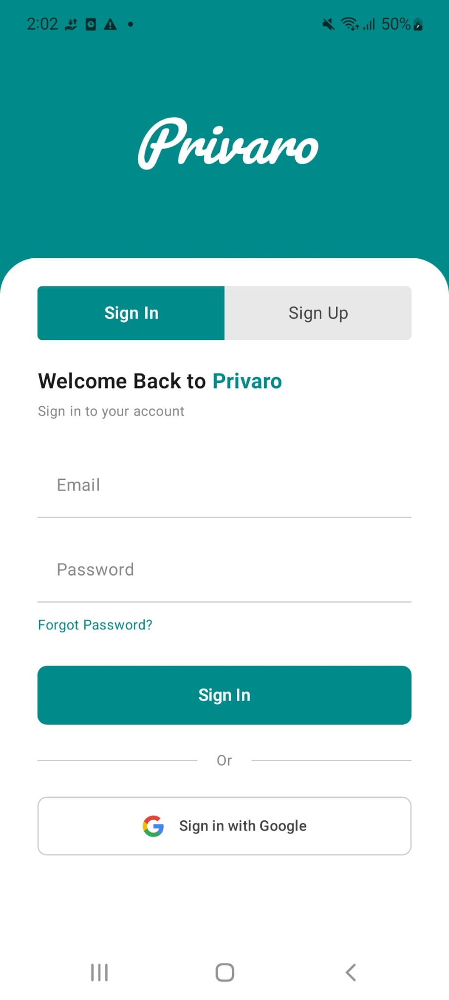
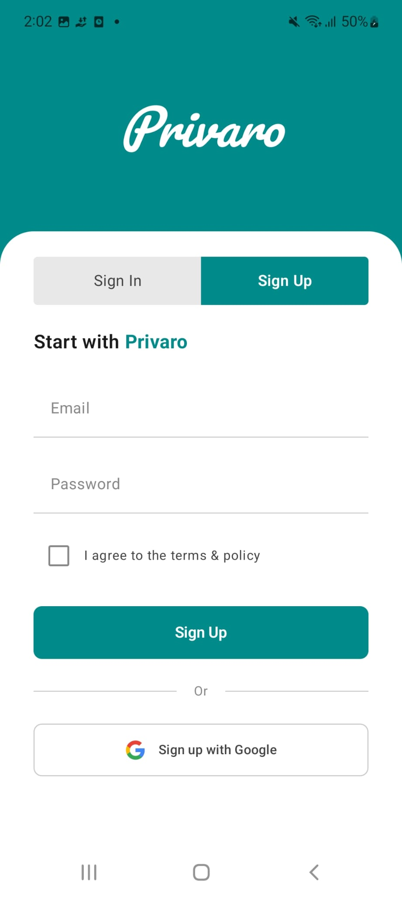
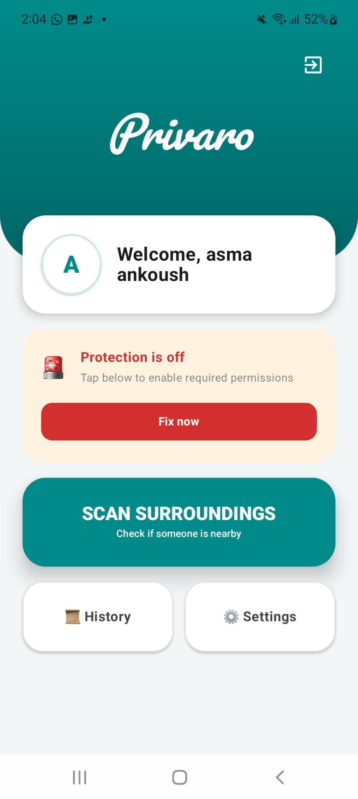
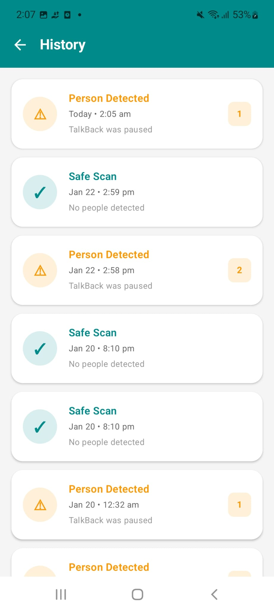
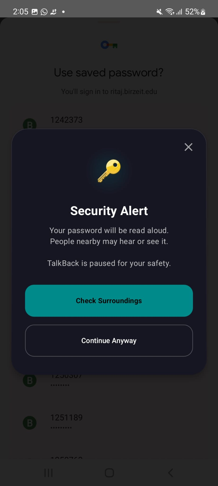
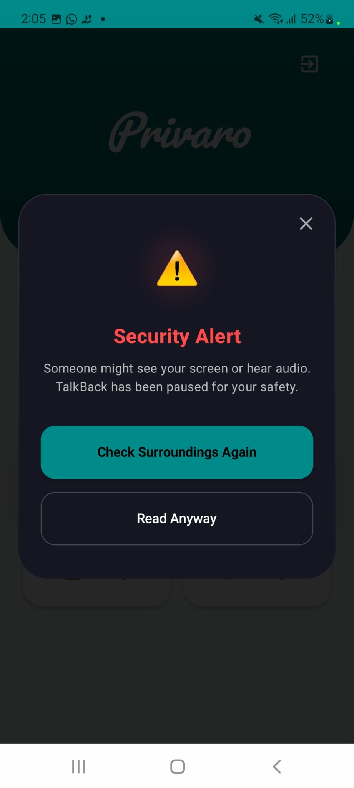
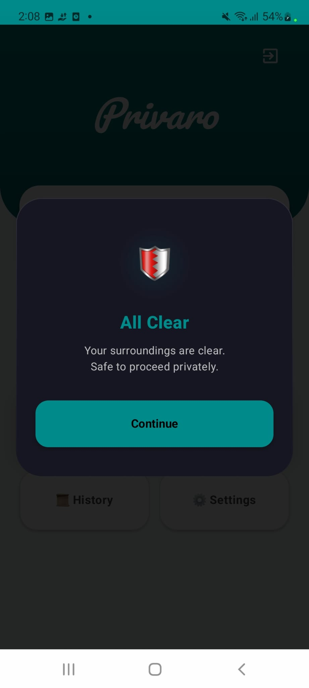

# 🔐 Privaro – Android Privacy Protection App

## 📌 Overview

Privaro is an Android security application designed to protect visually impaired users from **shoulder-surfing attacks** when using TalkBack.

The app detects when sensitive information is about to be spoken and analyzes the surroundings to ensure privacy.

---

## ⚡ Key Features

* Detects sensitive TalkBack events (passwords, private data)
* Runs in the background using Android system services
* Uses camera + AI to detect nearby people
* Alerts user before sensitive information is spoken
* Allows user to **pause or continue safely**
* Provides simple audio feedback

---

## 🧠 How It Works

1. TalkBack triggers a sensitive event
2. App intercepts using Accessibility Service
3. Camera scans surroundings
4. Detects presence of people
5. Alerts user and pauses TalkBack if needed

---

## 📱 Screenshots

  
  
  

  
  
  

  
  
  

---

## ⚙️ Tech Stack

* Kotlin (Android)
* Spring Boot (Backend)
* Gradle
* Android Accessibility Service
* Camera APIs
* Background services & system interrupts

---

## 🔒 Key Concepts

* Background execution & system-level hooks
* OS resource management (camera, accessibility, permissions)
* Privacy-aware design for accessibility users
* Real-time event-driven security

---

## 📁 Project Structure

* `app/` → Mobile application
* `backend/` → Spring Boot services
* `Project Proposal` → Proposal 

